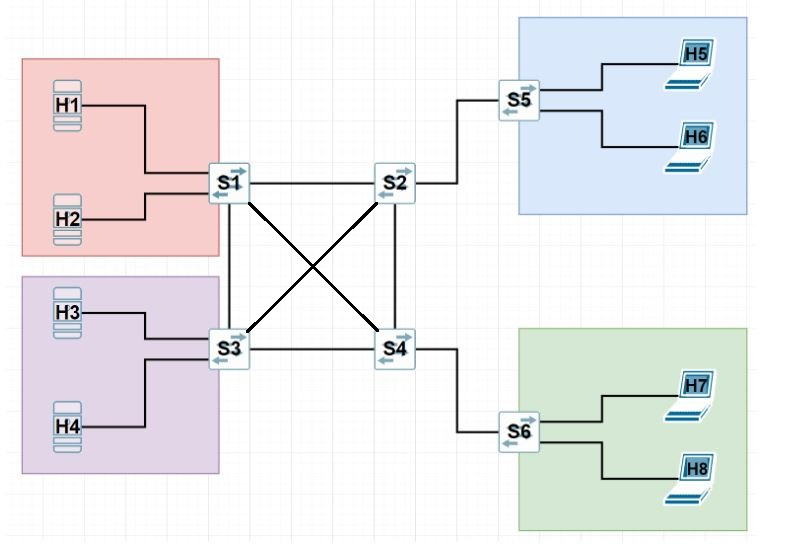
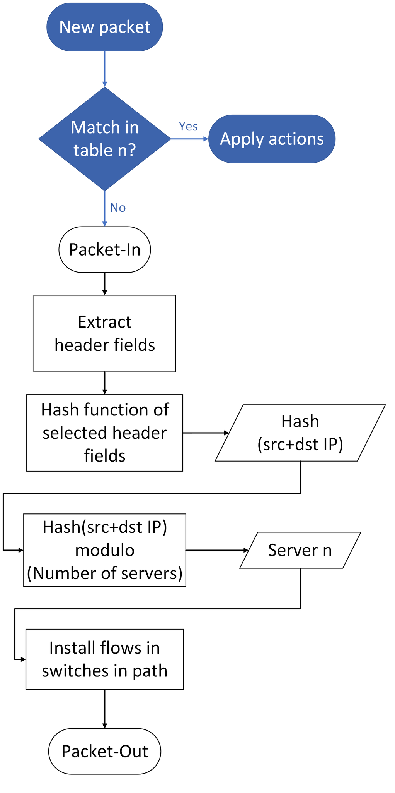

# Problem description
The aim of the project is to create a load balancer using the IP HASH algorithm in a topology consisting of servers and clients. We want the client, wanting to communicate with the server, to be connected to one of several available servers containing the same data (from the client's perspective, it does not matter to which server the query will be redirected).

We used **Mininet** to create and simulate the network topology and the **POX** driver to manage it

# Topology
Topology consists 4 servers (H1, H2, H3, H4), 4 clients (H5, H6, H7, H8) and 6 switches between them. Devices are connected as follows:



Actually, in the topology there is another **virtual host** that has a connection to all switches. For the client it is the server's address, in practice thanks to it the traffic is redirected from its address to the address of one of the four servers.

The script that defines and runs the topology is located in the file `topology.py`.

# Traffic generator

In the file `topology.py` there is also script that runs Iperf client on clients and Iperf server on servers. After running the `topology.py` file, traffic generator is ran as well.

# Load balancing algorithm
During load balancing we use hashing techniques of the source IP address and source port. Based on this hash we select **one of the four servers**.

On the switches located on the path leading to this server (paths are predefined) flows are installed.

The block diagram of this algorithm is as follows:



## Creating and running the topology

To create and run the topology, you must have the **Mininet** environment installed.

You also need to have **Python** installed (we recommend Python 2.7, but Python 3.6 and higher is applicable as well)

If you have Mininet and Python installed, just execute `topology.py` file with admin privileges. Sample command:

```
sudo python topology.py
```

## Running POX

This repository also contains the POX repository located in the `pox` folder.

When running POX it is necessary to use the following modules:
- forwarding.l2_learning
- openflow.spanning_tree
- openflow.discovery

We recommend using the following command:
```
./pox.py forwarding.l2_learning openflow.spanning_tree --no-flood --hold-down openflow.discovery host_tracker info.packet_dump
```

## Integration of the topology and the POX controller

There is a configuration in `topology.py` responsible for communication with remote controller on 127.0.0.1:6633.

Once the POX and topology are up and running, communication between them should be automatic. There is no need to perform any further steps.

## Useful commands

There are several commands that may be useful when working with a project:
- ```sudo mn -c``` - stops all Mininet processes and avoids errors when restarting Mininet
- ```xterm hostname``` - starts an Xterm terminal for a host named `hostname`
- ```sudo lsof -i :6633``` - checks which processes are listening on port 6633 or using this port at the moment. 6633 is a port used by POX controller
- ``sh ovs-ofctl dump-flows switchname`` - displays the current flow rules for a switch named `switchname` in Open vSwitch (OVS).

## Authors
- Szymon Jaskólski https://github.com/szymonjask
- Dominik Ziomek https://github.com/Dziomek
- Joanna Kozioł https://github.com/jokozo
- Filip Garzeł https://github.com/filipgarzel
