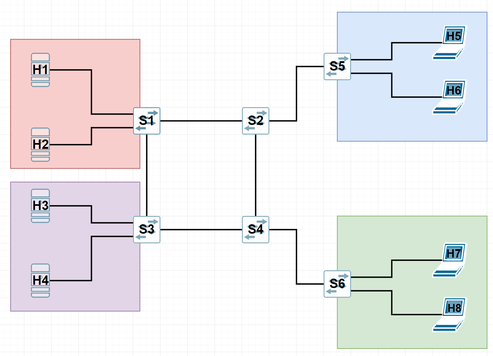

# Topology
Topology consists of 6 switches and 8 hosts. Devices are connected as follows:



The script that defines and runs the topology is in the file `topology.py`.


## Running the topology

Installation of Mininet is necessary for running the topology (Mininet VM Image is recommended).

If you use the right machine, just execute `topology.py` file, f.ex. with following command:

```
sudo python topology.py
```

## Integration with POX

There is a configuration in `topology.py` responsible for communication with remote controller on 127.0.0.1:6633.

To run POX controller to enable topology to communicate with it, use following command:

```
./pox.py forwarding.l2_learning openflow.spanning_tree --no-flood --hold-down openflow.discovery host_tracker info.packet_dump
```
